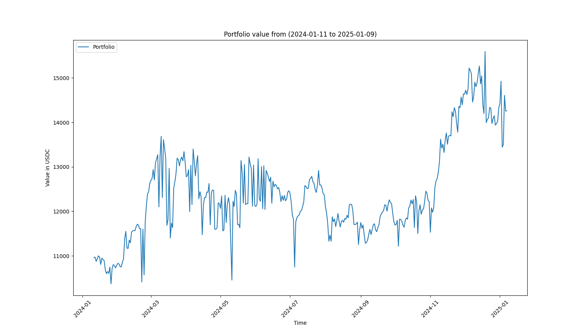

# How's it going?

Figure out the historical value of your current Stellar holdings with this one weird trick:

```bash
python -m venv .venv
source .venv/bin/activate
pip install -r requirements.txt

python main.py '[your G... account here]'
```

Here's an example output plot from an arbitrary user found via stellar.expert with a bunch of different holdings:



## Purpose

The purpose of this script is to answer a simple question about one's portfolio:

> How's it going?

It's easy to see a snapshot of your portfolio's _current_ total value in wallet apps like Lobstr or Freighter, but it's much harder to observe portfolio _performance_.

This script, given an account address, evalutes its fluctuation in value over the past year.

## Stipulations

It **does not** currently take into consideration the following:

 * deposits
 * withdrawals / transfers
 * any custom tokens held in smart contracts

It **does** give a simple, first-layer insight in the following way:

> What would my portfolio look like if I held what I hold today a year ago?

or, alternatively,

> Given an account, how would its current holdings have fluctuated over time?

Think of it as the homepage of any investment app _minus_ the fluctuations caused by the above.
